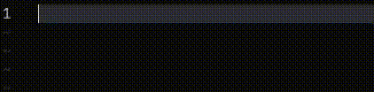

# Reference

## Subcommands

### Initializes
```shell
schema i
```
### Version
```shell
schema v 
```
### Pull
```shell
schema pull
```
### Migrate
```shell
schema migrate
```
```shell
schema migrate "sql file name"
```
### Rollback
```shell
schema rollback
```
```shell
schema rollback "sql file name"
```
### SQL
```shell
schema sql "sql command"
```
```shell
schema sql "sql file"
```
### Create
```shell
schema create "sql file name"
```
### Remove
```shell
schema remove "sql file name"
```
### Config
```shell
schema config -db="db type" -url="db url"
```
### Studio
```shell
schema studio
```

### LSP
```shell
schema lsp
```


## Flags

### DB
```shell
schema [subcommand] -db="db type"
```
### Database URL
```shell
schema [subcommand] -url="db url"
```
### Directory
```shell
schema [subcommand] -dir="directory"
```
### Root Directory
```shell
schema [subcommand] -rdir="root directory"
```
