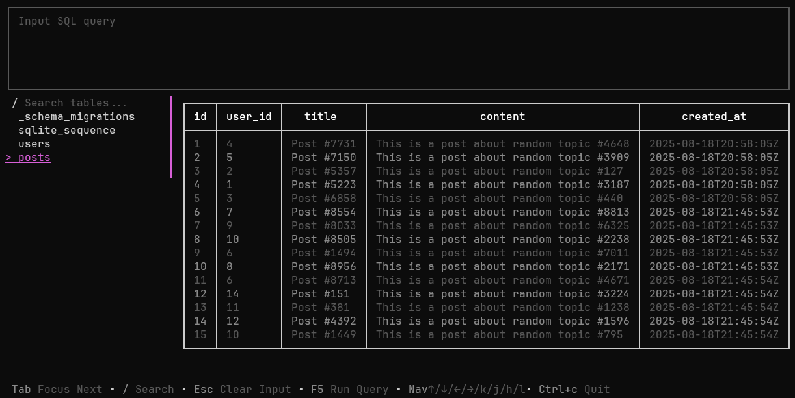

# Reference
All the flags

## Flags

### Initializes
```shell
schema -i
```
### Version
```shell
schema -v 
```
### Pull
```shell
schema -pull
```
### Migrate
```shell
schema -migrate
```
```shell
schema -migrate="0_file"
```
### SQL
```shell
schema -sql="sql command"
```
```shell
schema -sql="sql file"
```
### DB
```shell
schema -db="sqlite"
```
### Database URL
```shell
schema -url="db url"
```
### Create
```shell
schema -create="sql file name"
```
### Directory
```shell
schema -dir="directory"
```
### Root Directory
```shell
schema -rdir="root-directory"
```
### Studio
```shell
schema -studio
```

### LSP
```shell
schema -lsp
```
